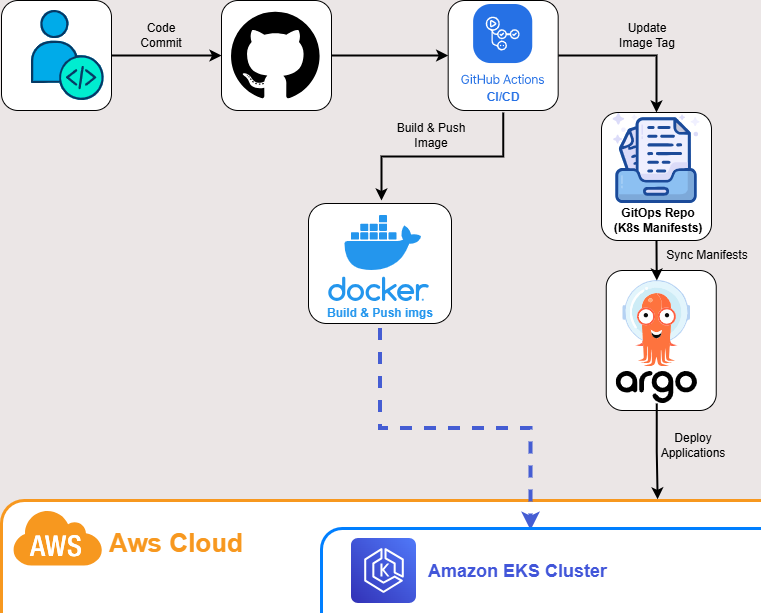

# Project 10 — GitOps Deployment Repository

## Overview
This repository contains the Kubernetes deployment manifests used by ArgoCD for GitOps-based application delivery.
The repository acts as the source of truth for application deployments across Development, Staging, and Production environments.

---

## Environments
* Development
* Staging
* Production

---

## Applications

### Frontend
* frontend-dev
* frontend-staging
* frontend-prod

### Backend
* backend-dev
* backend-staging
* backend-prod

---

## GitOps Workflow
ArgoCD continuously monitors this repository and automatically synchronizes the Kubernetes cluster whenever deployment manifests are updated.  

---
## Key Features

* GitOps-based deployment management
* Multi-environment configuration structure
* Automated synchronization using ArgoCD
* Git as the single source of truth
* Kubernetes deployment automation
* Environment separation for Development, Staging, and Production

---

## Related Project
The complete Platform Engineering implementation, including infrastructure provisioning, monitoring, observability, service mesh configuration, and canary deployment strategies, is documented in the main Platform Repository.

## Conclusion

This project demonstrates a complete Platform Engineering workflow on AWS using modern cloud-native technologies. It combines Infrastructure as Code, GitOps, observability, and service mesh capabilities into a production-inspired Kubernetes platform.

## Related Repositories

K8S platform Repository:
https://github.com/AliYasser2003/P10_Kubernetes-Platform-Engineering

## Author
Ali Yasser
